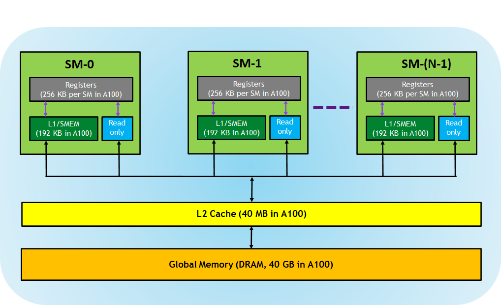

# cudacodes
```
>> CUDA enabled devices in the system: 1
>> Compute capability: 8.9
>> Max grid size: (2147483647, 65535, 65535)
>> Max block size: 1024
>> Number of SMs: 24
>> Clock Rate of the SMs (in kHz): 2370000
>> Max threads dimension: (1024, 1024, 64)
>> Max threads per SM: 1536
>> Registers available per block: 65536
>> Registers available per SM: 65536
>> Warp size (threads per warp): 32
>> Shared memory size per block: 49152 bytes
>> Shared memory size per SM: 102400 bytes
>> L2 Cache size: 33554432 bytes
>> Memory bus width: 128 bits
>> Memory clock rate: 8001000 kHz
>> Theoretical Max GFLOPS: 14561.28
>> Maximum Memory Bandwidth: 256.03 GB/s
```
- [CUDA Memory hierarchy](https://developer.nvidia.com/blog/cuda-refresher-cuda-programming-model/)
  - **CUDA Core → Registers → Shared Memory → L1 Cache → L2 Cache → Global Memory (VRAM)**

## GEMM
- [Learning CUDA Programming Through Matrix Multiplication Optimization](https://github.com/Yang-xinzhe/cudacodes/tree/main/mat_mul)
  - Implementation of matrix multiplication from naive to tiled version
  - Performance comparison with PyTorch
  - Detailed optimization process and benchmarks
