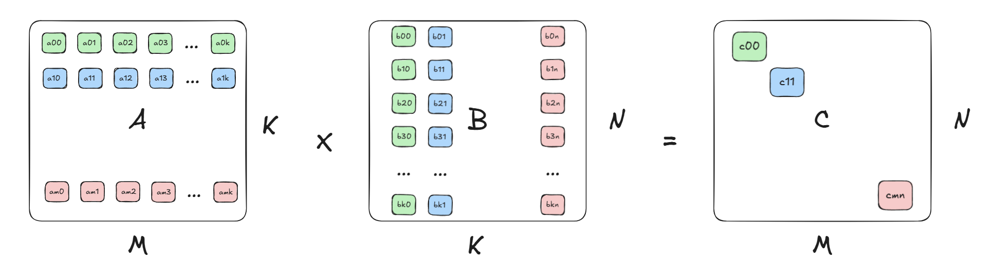

# Learning CUDA Programming Through Matrix Multiplication (GEMM) Optimization

Matrix multiplication is a fundamental operation in linear algebra and plays a crucial role in many computational tasks. For two matrices A (M×K) and B (K×N), their product C (M×N) is computed as:


$$c_{mn} = \sum_{k=0}^{K-1} a_{mk} \cdot b_{kn}$$

## Naive_xgemm_kernel
``naive_xgemm_1d_kernel``, performs general matrix multiplication (GEMM) in a naive, one-dimensional (1D) parallelized manner.
```
int tid = blockDim.x * blockIdx.x + threadIdx.x;
```
``tid`` represents the global thread index across all thread blocks.

For each valid thread corresponding to an output element $C[row,col]$, the kernel performs the dot product:
```
float sum = 0.0f;
for (int k = 0; k < K; k++) {
    sum += A_gpu[row * K + k] * B_gpu[k * N + col];
}
C_gpu[row * N + col] = sum;
```
This naive 1D GEMM kernel *assigns one thread per output element* in $C$,iterates over the shared dimension $K$,and performs the matrix multiplication directly in global memory. While functional, it can be significantly optimized for better performance.


