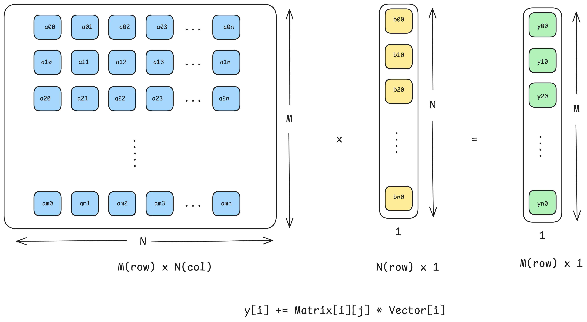

# Matrix-Vector Multiplication (GEMV): A Step-by-Step CUDA Optimization Guide
## Introduction to SGEMV

SGEMV (Single-precision General Matrix-Vector multiplication) is a fundamental operation in linear algebra that computes:
$$y = \alpha Ax + \beta y$$
where:
- $A$ is an $M \times N$ matrix
- $x$ is a vector of length $N$
- $y$ is a vector of length $M$
- $\alpha$ and $\beta$ are scalar values
- ``S`` indicates single-precision ``(32-bit)`` floating-point operations

**Performance ConsiderationsThe performance of SGEMV is typically memory-bound because:**
- Low computational intensity (``O(N²)`` operations vs ``O(N²)`` memory accesses)
- Limited data reuse (each matrix element used only once)- Memory access patterns affect cache efficiencyThis makes SGEMV an excellent case study for:
    - Memory optimization techniques
    - CUDA programming patterns
    - Performance analysis methods

## Benchmark - cuBLAS implementation
cuBLAS provides highly optimized SGEMV implementation but expects matrices in column-major format. However, our data is stored in row-major format. To handle this mismatch, we need to:
1. Either transpose the operation:
```Cuda
// Using matrix transpose when data is in row-major format
cublasHandle_t handle;
cublasCreate(&handle);
cublasSgemv(handle, CUBLAS_OP_T, N, M, &alpha, mat_gpu, N, vec_gpu, 1, &beta, res_gpu, 1);
```
`CUBLAS_OP_T` stands for transpose operation. It tells cuBLAS to treat the input matrix as transposed, effectively converting our row-major data to the expected column-major format without actually rearranging the data in memory.
For better understanding, let's look at how matrix-vector multiplication is implemented in row-major format:
```C
// Each iteration processes one row of the matrix
for(int i = 0 ; i < M ; ++i){
    float sum = 0.0f;
    for(int j = 0 ; j < N ; ++j){
        sum += matrix[i * N + j] * vector[j]; // Dot product of row i with vector
    }
    result[i] = sum;
}

```
CUDA Parallel Implementation:
```Cuda
// Each thread processes one row of the matrix in parallel
int row = blockDim.x * blockIdx.x + threadIdx.x;
if(row < M){
    float sum = 0.0f;
    for(int col = 0 ; col < N ; ++col) {
        sum += mat_gpu[row * N + col] * vec_gpu[col];
    }
    res_gpu[row] = sum;
}
```
The CUDA kernel parallelizes the outer loop of the CPU implementation, where each thread computes one element of the result vector by performing a dot product between a row of the matrix and the input vector. This maintains the row-major access pattern while leveraging GPU's parallel processing capabilities.

2. Or convert data to column-major format:
```cuda
// If data was stored in column-major format
cublasHandle_t handle;
cublasCreate(&handle);
cublasSgemv(handle, CUBLAS_OP_N, M, N, &alpha, mat_gpu, M, vec_gpu, 1, &beta, res_gpu, 1);
```
`CUBLAS_OP_N` stands for non-transpose operation (normal operation). This is used when the data is already in column-major format, and no transformation is needed.

When using column-major format (which matches cuBLAS's expectation), the implementation looks like this:
CPU Sequential Implementation (Column-Major):
```C
// Initialize result vector first
for(int i = 0 ; i < M ; ++i){
    result[i] = 0.0f;
}
// Process column by column
for(int j = 0 ; j < N ; ++j){
    for(int i = 0 ; i < M ; ++i){
        result[i] += matrix[j * M + i] * vector[j]; // Each column contributes to all elements in result
    }
}
```

CUDA Parallel Implementation (Column-Major):
CUDA Parallel Implementation:
```Cuda
// Initialize result vector (only once by the first thread)
int col = blockDim.x * blockIdx.x + threadIdx.x;
if(threadIdx.x == 0 && blockIdx.x == 0){
    for(int i = 0; i < M ; ++i){
        res_gpu[i] = 0.0f;
    }
}
__syncthreads();
// Each thread processes one column
if(col < N){
    for(int row = 0 ; row < M ; ++row) {
        // res_gpu[row] += mat_gpu[col * M + row] * vec_gpu[col];
        atomicAdd(&res_gpu[row], mat_gpu[col * M + row] * vec_gpu[col]);
    }
}
```
However, this column-major implementation has several drawbacks:

1. **Memory Access Pattern**:
   - Non-coalesced memory access in GPU
   - Poor cache utilization
   - Higher memory latency

2. **Atomic Operations**:
   - Multiple threads writing to same memory locations
   - Requires atomic operations, which are slower
   - Potential thread contention

3. **Initialization Overhead**:
   - Needs explicit result vector initialization
   - Additional synchronization required

This is why row-major format is generally preferred for performance, despite needing the transpose operation when using cuBLAS.

```bash
--------cuBLAS sgemv kernel-------
>> Execution time: 50.886 ms
>> Achieved (GFLOPS): 0.659 
>> Theoretical max (GFLOPS): 14561.279
>> Theoretical max memory bandwidth: 256.032 GB/s
>> Achieves 0.005 % of peak GFLOPS
>> Achieves 0.515 % of peak Memory Bandwidth
```
CUDA Kernel ``dim3 block_size(512)``
```bash
-------naive sgemv kernel--------
>> Execution time: 4.507 ms
>> Achieved (GFLOPS): 7.445 
>> Theoretical max (GFLOPS): 14561.279
>> Theoretical max memory bandwidth: 256.032 GB/s
>> Achieves 0.051 % of peak GFLOPS
>> Achieves 5.818 % of peak Memory Bandwidth
```